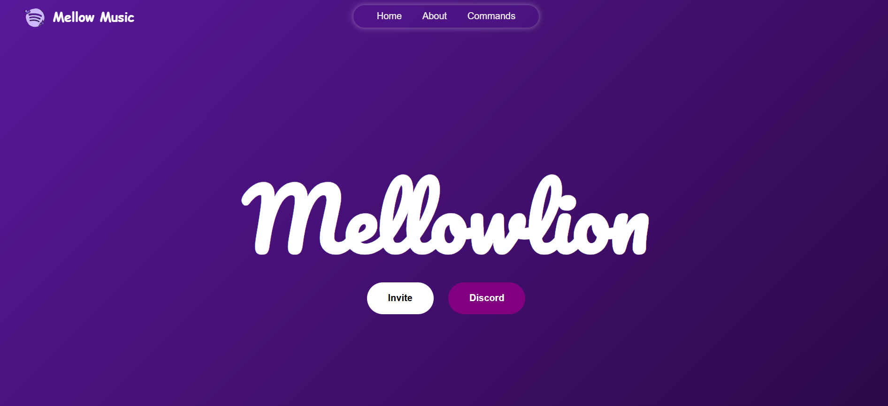

<p align="center">  </p>


<h1 align= "center" >Mellow Music — Discord Bot Website</h1>

<p align="center"> <a href="https://github.com/Piyush-devpy/Music-Bot-Mellow">  </a>   </p>

A modern and responsive website for the Mellow Music Discord Bot, designed to showcase features, commands, and provide an easy way for users to invite and interact with the bot.

---

## About the Project

This website serves as the frontend interface for the Mellow Music Bot, providing users with a clean and intuitive platform to:

- Explore bot features  
- View available commands  
- Invite the bot to their server  
- Learn how to use the bot  

The bot's backend and core functionality are available here:  
**Music-Mellow-bot** →https://github.com/Piyush-devpy/Music-Bot-Mellow

---

## Features

- Clean and modern user interface  
- Fully responsive design  
- Dedicated bot feature showcase section  
- Command list display  
- Invite button integration  


---
## Repository
```text
├──Image/
    ├── banner.png
    └── logo.png
├── README.md
├── index.html
└── style.css
```
## Tech Stack

- HTML5  
- CSS3 


